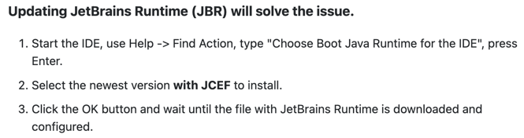
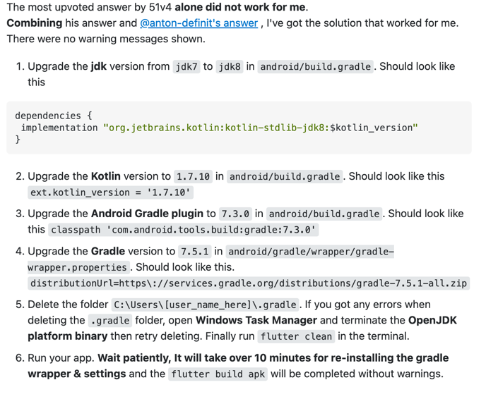

# learning_leitner

A new Flutter project.

## Getting Started

This project is a starting point for a Flutter application.

A few resources to get you started if this is your first Flutter project:

- [Lab: Write your first Flutter app](https://docs.flutter.dev/get-started/codelab)
- [Cookbook: Useful Flutter samples](https://docs.flutter.dev/cookbook)

For help getting started with Flutter development, view the
[online documentation](https://docs.flutter.dev/), which offers tutorials,
samples, guidance on mobile development, and a full API reference.

## Hive configuration
add hive_generator and build_runner to the dev dependencies

## Generate file continue following steps
1. add part '<name>.g.dart';
2. run => flutter packages pub run build_runner build

## Run the project
flutter run

## Create apk
1. flutter channel stable
2. flutter upgrade
3. flutter clean
4. flutter build apk --release
5. download file from build -> app -> outputs -> apk -> release

## Bug when download file from internet
On my phone (Android) Uri.https download file from internet was not working so I did the following
1. Got to android/app/src/main/AndroidManifest.xml
2. Add this line <uses-permission android:name="android.permission.INTERNET" /> before opening <application>

## Gradle cache is located at
You can browse to these directory and manually delete it or run
1. On Windows: %USERPROFILE%\.gradle\caches
2. On Mac / UNIX: ~/.gradle/caches/
3. rm -r $HOME/.gradle/caches/

## Get rid of this error
[!] Android Studio (version 2022.1) ✗ Unable to find bundled Java version.

**On Linux**
cd ~/android-studio/ && ln -s jbr jre

**Windows (check installation folder)**
1. cd C:\Program Files\Android\Android Studio
2. mklink /D "jre" "jbr"
or
3. New-Item -ItemType SymbolicLink -Path .\jre -Target .\jbr

**Mac OS**
1. cd /Applications/Android\ Studio.app/Contents
2. ln -s jbr jre

## Where is Android Studio Markdown support plugin preview

## flutter build Runtime JAR files in the classpath should have the same version. 
## These files were found in the classpath
[https://stackoverflow.com/questions/71347054/flutter-build-runtime-jar-files-in-the-classpath-should-have-the-same-version-t](https://stackoverflow.com/questions/71347054/flutter-build-runtime-jar-files-in-the-classpath-should-have-the-same-version-t)
